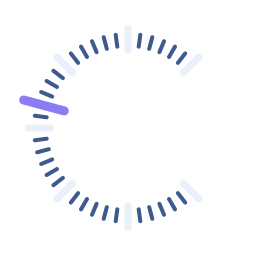
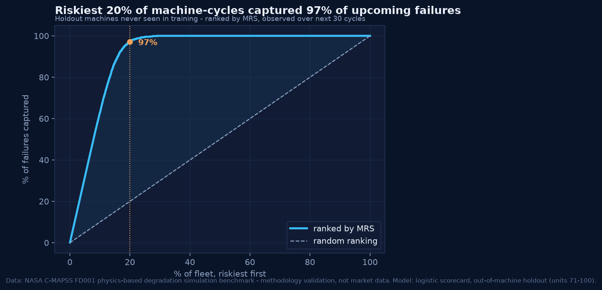

<p align="center"></p>
<h1 align="center">CALIBRUM <span style="color:#8B7CF6">衡准</span></h1>
<p align="center"><b>The financial standard for machines.</b><br>Proof of Operation → Reputation → Credit → Capital</p>

Machines generate abundant telemetry but zero financial-grade evidence, so insurers cannot price them and lenders cannot collateralise them. Calibrum turns hardware-signed operating receipts (**Proof of Operation**) into a portable **Machine Risk Score** that insurers, lenders and lessors price against.

> Lower verification cost → shorter Underwriting Distance → lower uncertainty → lower cost of machine capital.

## Reproduce the headline chart (under 30 minutes on a laptop)

```bash
git clone <this repo> calibrum && cd calibrum
make setup        # python 3.11 venv via uv + pnpm install        (~3 min)
make backtest     # downloads NASA C-MAPSS FD001 (3 MB), trains MRS v0, writes engine/mrs_v0/out/   (~15 s)
open engine/mrs_v0/out/lift_curve.png
```

**Result:** on 30 holdout machines never seen in training, the riskiest 20 % of machine-cycles captured **97 %** of failures in the next 30 cycles. AUC 0.99 · KS 0.92. Ablations: age-only AUC 0.87 vs sensors-only 0.99 — the signal is degradation telemetry, not a leaked clock.

<p align="center"></p>

*Data: NASA C-MAPSS FD001 physics-based degradation simulation benchmark — methodology validation, not market data. Model: logistic scorecard, out-of-machine holdout (units 71–100).* The pipeline is `engine/mrs_v0/run_mrs_v0.py`, unchanged from the founder's package; it reproduces the committed model coefficient-for-coefficient.

## Five-minute tour: story → evidence → play → verify

```bash
make dev          # http://localhost:3000   (or: npm install && npm run dev)
```

| | | |
|---|---|---|
| **Landing** | "The next billion borrowers may not be human." Telemetry → Evidence → Reputation → Capital; the four real charts with their captions; one engine across three cohorts; the reproduce block. | `apps/web/app/page.tsx` |
| **01 Passport** | Identity (did:key), verified hours, maintenance, incidents, residual value; the MRS dial rendered as the brand's calibration ring; grade chip; insurance / debt / wallet. | |
| **02 Risk** | Failure-probability projection, expected loss, anomaly timeline, and **"why this changed"**: the top-5 signed coef·z deltas, which sum to the logit change exactly. | |
| **03 Finance** | Three live offers repriced from MRS — insurer premium, lender LTV/rate, credit-pool availability — with the formulas on screen. | |
| **04 Wallet** | The mUSDC economy: run +100h/+500h, maintain, insure at the MRS-priced premium, borrow against LTV, trigger an incident (everything reprices), settle an eligible claim. Every action emits a signed receipt. | |
| **05 Verify** | The Proof Ledger: hash-chained, Ed25519-signed receipts. **Verify** recomputes every hash, link and signature and runs the physics envelope; **Tamper** corrupts one field so you can watch a specific link fail for a specific reason. | |
| **Underwriting Playground** (drawer) | Eight sliders → the contract's 43 features via a documented mapping → repriced through the contract. Switch models via a dropdown labelled with dataset provenance. | `docs/slider-mapping.md` |

Every score in the app is computed by `engine/mrs_v0/out/mrs_model.json` (or a sibling cohort contract) — the JSON the Python pipeline wrote — through one function, `scoreVector`, tested against Python-generated golden vectors to 1e-6. Every simulated number is labelled *Illustrative demo model*.

## The model contract

`mrs_model.json`: `{ kind: "logistic_scorecard_v0", event, features[43], mean, std, coef, intercept, score_scaling: { PDO: 40, base_score: 600, base_odds: 15, clip: [300, 850] }, holdout_metrics }`.

z = (x − mean)/std · logit = intercept + Σ coef·z · p = 1/(1+e^−logit) · MRS = clip(600 + (40/ln 2)·ln(((1−p)/p)/15), 300, 850).

Financial mapping (illustrative, monotone, labelled everywhere): premium = 9.0 % − MRS/1000 × 7.5 % of asset value per year · max LTV = 25 % + MRS/1000 × 55 % · spread = (1200 − MRS) bps over SOFR · residual = 30 % + MRS/1000 × 40 % of cost.

## Proof of Operation — verify a receipt yourself

```bash
make verify-poo
# wrote 7 signed receipts for did:key:z6Mk… → receipts.json
# RESULT: PASS — chain intact, signatures valid, physics consistent.
# tampered receipt #3: context.energy_wh 8881 → 88810 (hash and signature left untouched)
# [FAIL] #3 rcpt_…_00003
#        FAIL hash/hash_recompute: stored 624b…7287 ≠ recomputed ed70…eaa2 — body was modified after signing
#        FAIL signature/ed25519: signature covers the stored hash but not the current body — content was edited after signing
#        FAIL physics/energy_vs_hours: average draw 5319 W outside 150–900 W for amr_transport — energy inconsistent with claimed hours
# RESULT: FAIL — see failed checks above.
```

`packages/poo` (MIT, publish-ready): Ed25519 via `@noble/curves`, SHA-256 over canonical JSON, per-machine hash chain, Merkle batching, chain-agnostic anchor interface (mock + EVM stub), JSON and CBOR views, verifier logic at 100 % coverage. Spec and threat model: [`docs/poo-spec.md`](docs/poo-spec.md). A signature proves the sensor said X, not that X happened — §8 maps forged sensors, replay, split history and sybil attesters to physics cross-checks, adversarial financial outcomes, and stake-and-slash.

## One engine, three cohorts (and two more waiting on data access)

```bash
make backtest-cohorts     # C-MAPSS FD001 / FD002 / FD004 through engine/lib/mrslib.py → engine/cohorts/out/<cohort>/
```

| cohort | machines | data | AUC | top-20 % capture |
|---|---|---|---|---|
| MRS v0 · C-MAPSS FD001 | 100 | simulation, 1 condition | 0.99 | 97 % |
| C-MAPSS FD002 | 260 | simulation, 6 conditions | 0.99 | 92 % |
| C-MAPSS FD004 | 249 | simulation, 6 conditions, 2 fault modes | 0.97 | 91 % |
| Backblaze Drive Stats | 100K+ real drives | field data | pipeline shipped, **not run** — see `DECISIONS.md` | |
| Alibaba PAI GPU trace 2020 | ~1 800 nodes | field trace, failure-burst proxy | pipeline shipped, **not run** — see `DECISIONS.md` | |

Same 43 features, same scorecard, same report format; each cohort writes a Part-4 contract the app can switch to. Cohorts are not merged at v0 — comparability of one simple method across asset classes is the story.

## Simulation: why insurers are the first customers

```bash
make sim      # 10,000 simulated insured years of an 8-machine book → sim/out/underwriting_mc.{png,json}
```

Flat pricing: mean loss ratio **157 %**, loses money 73 % of years. MRS pricing, insure everything: **104 %**. MRS pricing and decline below 550: **68 %**, loses money 28 % of years. SIMULATION with an invented hazard curve — it demonstrates adverse selection, not any real book.

## Repository

```
apps/web/          Next.js 16 + TypeScript + Tailwind 4 + Recharts — the investor app
packages/poo/      Proof of Operation reference implementation + CLI (MIT)
engine/            mrs_v0 (unchanged baseline) · lib/mrslib.py (shared engine) · cohorts/ · fixtures/ (golden vectors, CI samples) · tests/
sim/               underwriting Monte Carlo (python -m calibrum_sim)
docs/              poo-spec.md · slider-mapping.md · handoff/ (essay, specs, original prompt)
assets/            brand, deck, founder demos (read-only references)
data/              gitignored; make targets download here
DECISIONS.md       trade-offs, newest first — read this first
```

`make test` runs everything: poo (with coverage thresholds), web (golden vectors, proof-chain, pricing, wallet reducer), engine (framework reproduces v0; smoke pipelines on committed fixtures), sim. CI does the same plus a production build and a sign → tamper → verify check that must fail.

## Honesty notes

1. C-MAPSS is simulated physics, not field data — it proves the pipeline, not the market. Real-hardware cohorts were blocked by the build environment's network policy, not by the code; `DECISIONS.md` has the one-command path.
2. Pricing functions are placeholders until calibrated against a real claims/loan book with a design partner.
3. The demo machine, its wallet and its receipts are simulated and say so on screen; the model that scores them is the real trained artefact.
